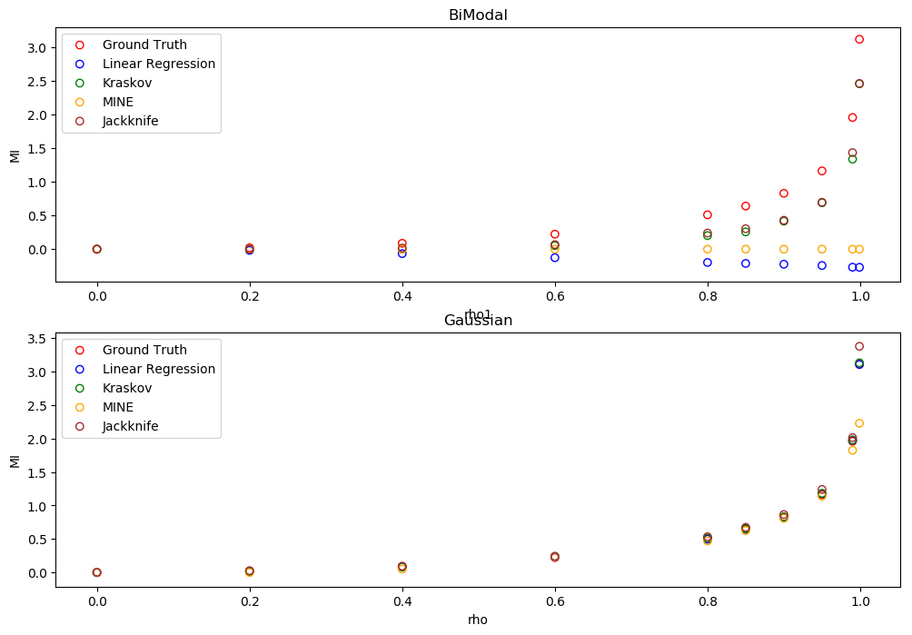

# MMI estimation





## Dependencies
- pytorch
- joblib
- sklearn
- numpy
- scipy
- matplotlib
- tqdm

## Dependencies for if-estimators
- oct2py

## Dependencies for AIC (better install following packages with brew if your machine is Mac)
- cmake
- boost
- python3
- boost-python3
## build AIC module
```bash
cd MMI/IC
cmake src/
# set paths of python3, boost and boost-python3 in CMakeCache.txt
# and then cmake again
# until you see "-- Generating done"
make
# if successful, you will see
# Scanning dependencies of target AIC
# [ 50%] Building CXX object CMakeFiles/AIC.dir/pylib.cpp.o
# [100%] Linking CXX shared library AIC.so
# [100%] Built target AIC
# now AIC is built
```

## How to run
```bash
cd ..
# check the configuration in settings.py
python -m MMI/main
```

## How to add new mi estimators
- go to ```model/``` 
- create a new class (see mine.py/linear_regression.py for example)
- must contain the predict function (given a N by 2 matrix, return the MI estimator (float))
- go to settings.py, add the corresponding configuration in the variable *model*

## How to add new synthetic data
- go to ```data/``` 
- create a new class (see bimodal.py for example)
- must contain the two property: *data* and *ground_truth* (see bimodal.py for example)
- go to settings.py, add the corresponding configuration in the variable *data*
